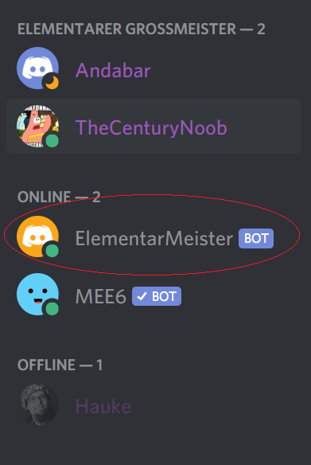
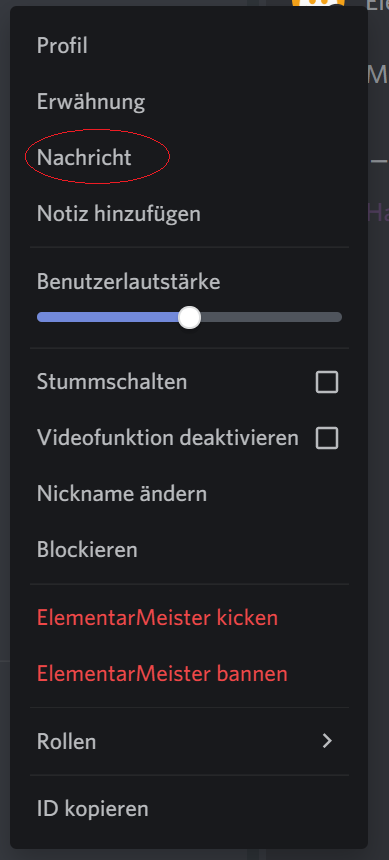
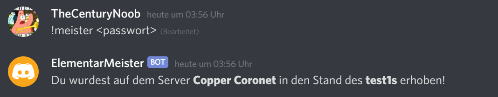
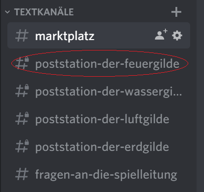
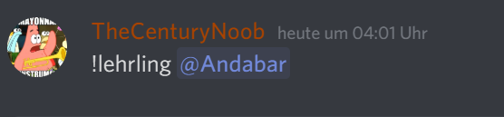
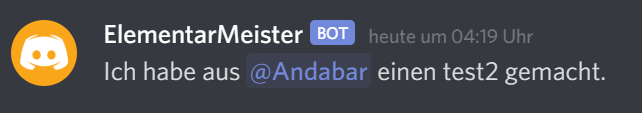

# ElementarMeister Bedienungsanleitung

1. Elementarmeister werden
Um Elementarmeister zu werden benötigt ihr zunächst das Passwort eures Elements. Dieses bekommt ihr bei den Organisatoren und es ist das selbe, wie auch für das Forum.
   
Anschließend, müsst ihr euch beim `ElementarMeister` zum Elementarmeister ernennen lassen. Hierfür müsst ihr eine direkte Konversation mit dem Bot führen.

- Rechtsklicke in der rechten Seitenleiste auf den `ElementarMeister`-Bot



- Klicke auf den Reitereintrag `Nachricht`



Im direkten Chat mit dem `ElementarMeister` könnt ihr diesem nun das Passwort verraten, indem ihr folgende Nachricht schickt: 

```
!meister <meister-passwort>
```

Wenn alles funktioniert hat, sollte der Bot dir antworten, dass du erfolgreich zum Meister gemacht wurdest, ähnlich wie hier:




1. Elementarlehrlinge aufnehmen

Um nun deine Lehrlinge in ihren Rang zu erheben, musst in auf den Discord Server wechseln um deine Lehrlinge erwähnen zu können. Eine Erwähnung im Chat kann man auf einfache Weise erzeugen, indem man vor den Namen des zu erwähnenden ein `@`-Symbol anfügt.

- Wechsle in einen Text-Kanal auf dem Server, indem du in der linken Seitenleiste auf eine dir verfügbare Poststation klickst 



- Ernenne deine Lehrlinge mit folgendem Befehl

```
!lehrling @Lehrling-Name-1 @Lehrling-Name-2 ... 
```

Ein konkreteres Beispiel hierfür ist

```
!lehrling @Andabar
```




Wenn alles funktioniert hat, sollten deine Lehrlinge die richtige Rolle zugewiesen bekommen haben und ebenfalls in der Lage sein die Poststation eures Elements zu sehen.

Du bekommst zusätzlich eine direkte Nachricht vom `ElementarMeister`-Bot die dir das gelingen bestätigt.

